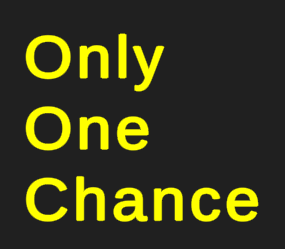
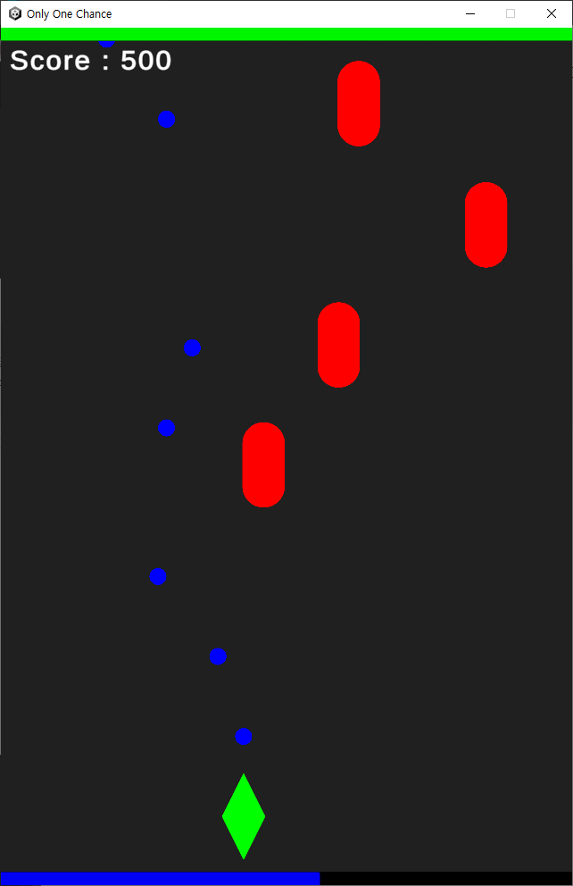
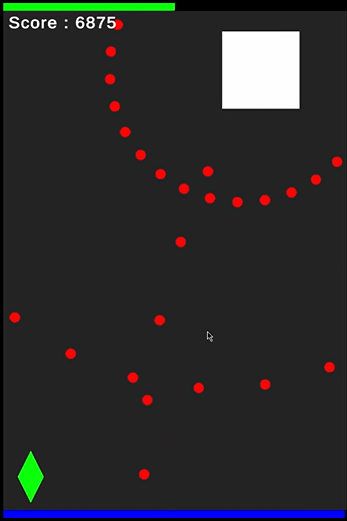
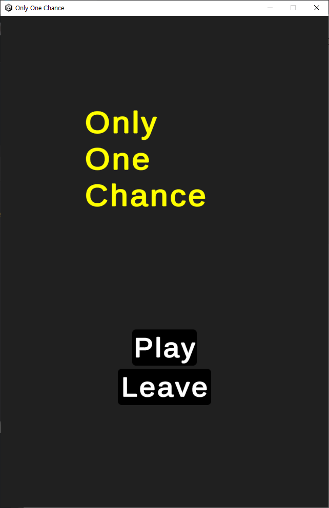
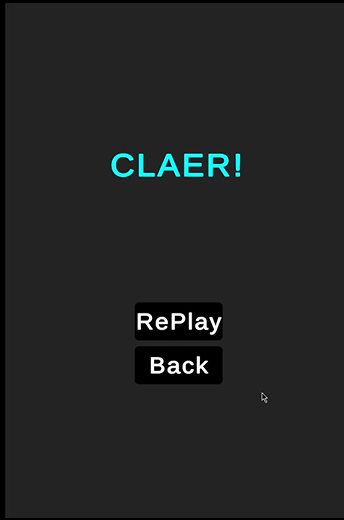

# Only One Chance

<div align="center">
<a href="#">
  
</a>
<!--타이틀 잘라서 넣어주기-->

[](https://hits.seeyoufarm.com)

</div> <!--가운데 정렬은 여기까지-->

## 프로젝트 정보
> **1학년 1학기 수행평가**  
> **2022.05월경 ~ 2022.06.26**

## 게임 설명
<div align="center">

|  InGame   |
| :-------: |
| <a href="#">   </a> |

|   Intro   |   Outro   |
|:---------:|:---------:|
| <a href="#">  </a> | <a href="#">  </a> |

</div>

> **Only One Chance는 1학년 1학기 동안 배운 내용을 응용해서 약 1개월동안 만든 간단한 PC 슈팅게임입니다.**  
> **플레이어 쪽으로 날라오는 적, 한 방향으로 내려오는 적이 랜덤으로 생성되며 3가지의 패턴을 가진 보스가 존재합니다.**

## 빌드본 다운
> **구글 드라이브** : [https://drive.google.com/file/d/1hb1mr_L1kKyg1mslgdt7ng5TSz4dKZUp/view?usp=sharing] <br>

## 개발팀 소개
<div align="center">

| <a href="https://github.com/lIo0O0oIl"> lIo0O0oIl </a> |
| :-----------: |
| <a href="https://github.com/lIo0O0oIl">  </a> |
| 1인 개발 |

</div>

## 사용한 것들
<div align="left"> <a href="#">


</a> </div>
<a href="#">
  
</a>

## 구조
```bash
2022_1_ONLY_ONE_CHANCE\ASSETS
├─1_Scenes
│      GameClaer.unity
│      GameOver.unity
│      Intro.unity
│      Play.unity
│
├─2_Scripts
│  │  ButtonEvent.cs
│  │  Leave.cs
│  │  Leave.cs.meta
│  │
│  └─GamePlay
│          AutoDestroyer.cs
│          Boss.cs
│          BossBullet.cs
│          BossHP.cs
│          Bullet.cs
│          Bulletile.cs
│          Enemy.cs
│          EnemySpawner.cs
│          Enemytile.cs
│          Mana.cs
│          ManaViewer.cs
│          Movement.cs
│          Player.cs
│          PlayerHP.cs
│          PlayerHPViewer.cs
│          PlayerScoreViewer.cs
│          ResultScoreViewer.cs
│          StageData.asset
│          StageData.cs
│
├─3_Prefabs
│      BossBullet.prefab
│      Bullet.prefab
│      Enemy.prefab
│
├─4_Sounds
         Rinne - Connect.mp3
```

## 참고
> **삼각함수 관련** : [https://drive.google.com/file/d/1hb1mr_L1kKyg1mslgdt7ng5TSz4dKZUp/view?usp=sharing] <br>
